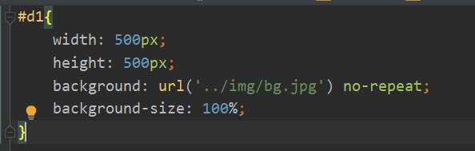
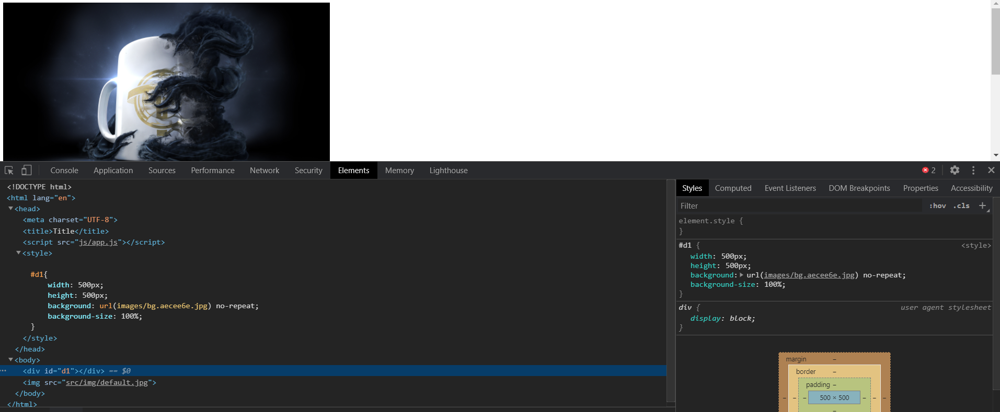
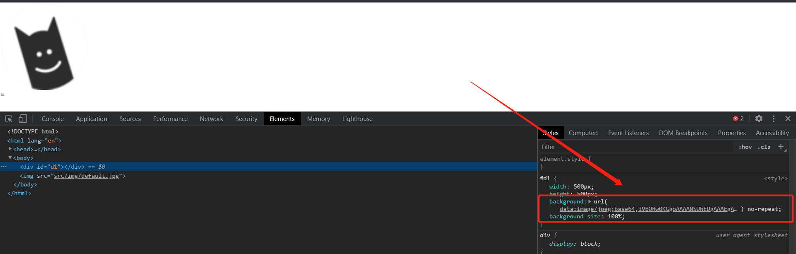
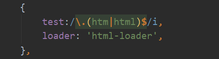
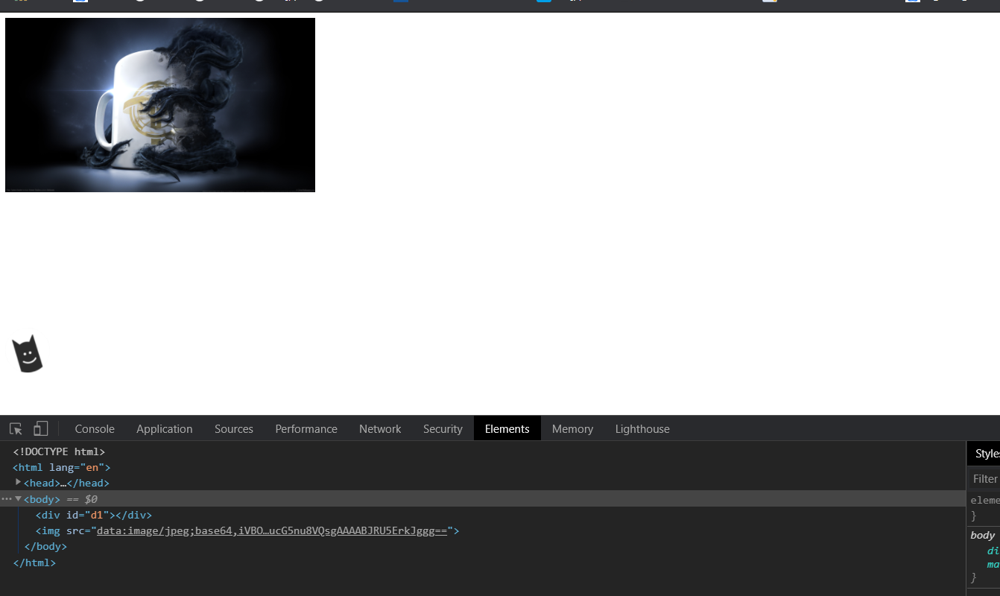

# 项目路径

# webpack配置

这里的url-loader配置表明遇到图片时，采用url-loader进行转换，在options的参数中，**limit表示图片采用base64转换的最大字节，即如果小于8192字节，就进行base64转换（图片内嵌的形式，可以减少http请求），否则就输出到images文件夹下，命名方式为:name.哈希值前7位.原文件名。**
# 处理CSS、html模板中的图片

_1.jpg)

**首先说下项目中bg.jpg的大小为2.56MB（远远超过8192字节），而default.jpg的大小只有5.25kb（小于8192字节）**

**简单地编写完css和模板html后，在命令行中输入webpack进行打包。结果如下：**

**可以看到只有大图bg.jpg能够成功打包并显示，而default.jpg却并没有被转换为内嵌的base64图片。**

**而将css中的背景图换为default.jpg后，却可以看到已经转化成base64成功并显示。**

==**出现的问题：模板html中的img可能并没有经过webpack的解析。** #F44336==

**查了半天资料后才知道是没有安装html-loader插件，安装成功后在webpack配置文件中添加以下代码即可。**

**运行结果：**
